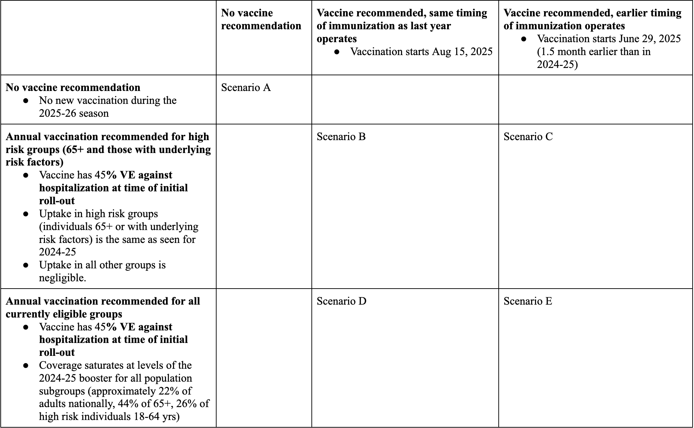

# COVID-19 Scenario Modeling Hub

Last updated: 2025-04-02 for **Round 19 Scenarios**.

## Previous Round Scenarios and Results:

<https://covid19scenariomodelinghub.org/viz.html>

Previous rounds (round 1 to round 18) are available in the 
[COVID-19 Scenario Modeling Hub - Archive](https://github.com/midas-network/covid19-scenario-modeling-hub_archive) 
GitHub Repository

## Rationale

Even the best models of emerging infections struggle to give accurate
forecasts at time scales greater than 3-4 weeks due to unpredictable
drivers such as a changing policy environment, behavior change, the
development of new control measures, and stochastic events. However,
policy decisions around the course of emerging infections often require
projections in the time frame of months. The goal of long-term
projections is to compare outbreak trajectories under different
scenarios, as opposed to offering a specific, unconditional estimate of
what "will" happen. As such, long-term projections can guide longer-term
decision-making while short-term forecasts are more useful for
situational awareness and guiding immediate response. The need for
long-term epidemic projections is particularly acute in a severe
pandemic, such as COVID-19, that has a large impact on the economy; for
instance, economic and budget projections require estimates of outbreak
trajectories in the 3-6 month time scale.

From weather to infectious diseases, it has been shown that synergizing
results from multiple models gives more reliable projections than any
one model alone. In the COVID-19 pandemic this approach has been
exemplified by the [COVID-19 Forecast
Hub](https://covid19forecasthub.org/), which combines the results of
over 30 models (see a
[report](https://www.medrxiv.org/content/10.1101/2020.08.19.20177493v1)
on the first wave of the pandemic). Further, a
[comparison](https://www.medrxiv.org/content/10.1101/2020.11.03.20225409v1)
of the impact of interventions across 17 models has illustrated how any
individual model can grossly underestimate uncertainty, while ensemble
projections can offer robust projections of COVID-19 the course of the
epidemic under different scenarios at a 6-month time scale.

The [COVID-19 Forecasting Hub](https://covid19forecasthub.org/) provides
useful and accurate short-term forecasts, but there remains a lack of
publicly available model projections at 3-6 month time scale. Some
single models are available online (e.g.,
[IHME](https://covid19.healthdata.org/united-states-of-america), or
[Imperial College](https://www.imperial.ac.uk/mrc-global-infectious-disease-analysis/covid-19/report-33-vaccine/)),
but a decade of infectious disease forecasts has demonstrated that
projections from a single model are particularly risky. Single model
projections are particularly problematic for emerging infections where
there is much uncertainty about basic epidemiological parameters (such
as the waning of immunity), the transmission process, future policies,
the impact of interventions, and how the population may react to the
outbreak and associated interventions. There is a need for generating
long-term COVID-19 projections combining insights from different models
and making them available to decision-makers, public health experts, and
the general public. We plan to fill this gap by building a public
COVID-19 Scenario Hub to harmonize scenario projections in the United
States.

We have specified a set of scenarios and target outcomes to allow
alignment of model projections for collective insights. Scenarios have
been designed in consultation with academic modeling teams and
government agencies (e.g., CDC).

This repository follows the guidelines and standards outlined by the 
[hubverse](https://hubverse.io), which provides a set of data formats
and open source tools for modeling hubs.

## How to participate

The COVID-19 Scenario Modeling Hub is be open to any team willing to
provide projections at the right temporal and spatial scales, with
minimal gatekeeping. We only require that participating teams share
point estimates and uncertainty bounds, along with a short model
description and answers to a list of key questions about design. A major
output of the projection hub would be ensemble estimates of epidemic
outcomes (e.g., cases, hospitalization and/or deaths), for different
time points, intervention scenarios, and US jurisdictions.

Those interested to participate, please read the README file and email
us at
[scenariohub\@midasnetwork.us](mailto:scenariohub@midasnetwork.us).

Model projections should be submitted via pull request to the
data-processed folder of this GitHub repository. Technical instructions
for submission and required file formats can be found
[here](./model-output/README.md).

## Round 19 Scenarios

Round 19 focuses on the impact of different target populations for 
COVID-19 boosters combined with different timing of vaccination for 
the 2025-2026 season. The timeframe of projections will be Sun 
April 27, 2025 to Sat April 25, 2026 (52 weeks).

#### **Vaccine Efficacy**

In all scenarios, boosters are expected to match the predominant variants 
circulating on June 30, 2025.  **Teams should use VE against COVID-19 
hospitalization = 45% at the start of the vaccination campaign (either 
July 15 or Sep 1, 2025)**, in line with a 
[recent US](https://www.cdc.gov/mmwr/volumes/74/wr/mm7406a1.htm) analysis 
of hospitalizations during September-December 2024. We note that in this 
study, VE against hospitalization was similar 0-2 vs 3-4 months after 
vaccine receipt, and among immuno-compromized vs healthy individuals. The 
study was only powered to estimate VE hospitalizations in individuals 65+ 
yo but it is generally accepted that COVID-19 VE does not depend on age. 
We recommend using the same VE across all population groups considered in 
round 19.

This VE is equivalent to a vaccine trial that would be performed at the start 
of the vaccination campaign in populations with varying levels of prior 
immunity at trial enrollment. Vaccinated individuals would have a 45% reduced 
risk of hospitalization compared to unvaccinated individuals on average in 
this trial, if VE was estimated a few days after the start of the campaign. 
Importantly, this stated hospitalization reduction includes the combined 
effects of protection against infection and protection against hospitalization 
given (breakthrough) infection. This is the same logic we used in round 18. 
Based on available evidence, we suggest that teams choose VE against **infection** 
in the range 35-57% at the start of the vaccination campaign (see 
[VE Estimates 2023/2024](https://docs.google.com/document/d/1H-6Q9dIDjLCubU-oRAoVHyw7Lr-rlb_D_zp31hNyMGw/) 
for detailed studies).

Two mechanisms will result in an effective decrease from the stated VE of 45% 
against hospitalization.  The first mechanism is immune escape, with circulating 
strains moving gradually away from the vaccine. In this round, immune escape 
against infection and severe disease is at teams’ discretion (we return to this 
later).

The second mechanism is waning of immunity against infection, due to decline in 
immune responses over time. This applies to both vaccine-induced and natural 
immunity. Parameters for waning immunity against infection are left at teams 
discretion, although we suggest  a 3-10mo waning time, with 40-60% reduction 
against baseline protection levels in waned state. Waning of vaccine-induced 
immunity against severe disease remains at teams discretion (but if present 
should wane at slower timescale than against infection).

#### **Vaccine Timing**

In this round, we consider two different timings of vaccination. Scenarios B and 
D correspond to a “classic” timing of initiation of the seasonal vaccination 
campaign, with a start on Sep 1, 2025. This is the timing that is expected to 
operate in the 2025-26 season. We also consider hypothetical scenarios C and E, 
where vaccination is pushed 1.5 month earlier and starts on July 15, 2025 (meaning 
that the entire vaccine manufacturing and delivery process is moved earlier in time). 
These hypothetical scenarios may be useful to project the potential value of earlier 
vaccination campaigns in future COVID19 seasons, in light of substantial summer 
waves of COVID-19 observed in recent years.  Vaccine coverage curves is 
provided for all scenarios and reflects the stipulated timing of vaccination 
in each scenario (available in the 
[auxiliary-data/vaccination-coverage](./auxiliary-data/vaccination-coverage/) folder).

#### **Vaccination Coverage**

Vaccine coverage curves is provided for all scenarios and will be extrapolated 
from the 
[2024-25 data](https://www.cdc.gov/covidvaxview/weekly-dashboard/adult-vaccination-coverage.html). 
The data are available in the 
[auxiliary-data/vaccination-coverage](./auxiliary-data/vaccination-coverage/) folder.

*No recommendation (scenario A)*: There is no future recommendation to get additional 
booster doses or receive additional vaccination. Teams should not model any future 
vaccination in the projection period, i.e., vaccine coverage is 0% in all population 
groups. Without recommendation, vaccines will not be covered by insurance or other 
sources.

*Annual vaccination recommended for high risk groups (65+ and those with underlying 
risk factors)(scenarios B & C)*: Uptake of annual booster in high-risk groups (65+ and 
other individuals with underlying risk factors for severe COVID-19 outcomes) follows 
uptake observed for the booster dose during the 2024-25 season. Vaccination among 
non-recommended groups should be modeled as negligible (ie, 0%) as without 
recommendation, these groups will not be covered by insurance or other health care 
funding. Vaccine uptake data in 65+ and high-risk groups will be provided.
 
*Annual vaccination recommended for currently eligible groups (ages 6 months and older)
(scenarios D & E)*: Uptake of annual booster in all groups follows uptake observed for 
the booster dose during the 2024-25 season. Uptake data for all groups will be provided.

In this round, we assume that high-risk populations, of any age, are included in booster 
recommendations in *scenarios B, C, D & E*. We define high-risk groups as those with 
underlying conditions putting them at increased risk of severe outcomes from COVID-19. 
Data on the population size and vaccine coverage of high and low risk groups is provided 
by state and age in GitHub. Teams can choose to adjust VE for high-risk and low-risk 
groups based on available evidence, although the population-level average VE against 
hospitalization should equal 45% on September 1. Data on increased risk of COVID-19 
hospitalization from high risk groups can be found 
[here](https://academic.oup.com/cid/article/72/11/e695/5908300). If teams wish to 
adjust VE based on specific risk conditions, they can refer to data on VE in 
immunocompromised populations 
[here](https://www.cdc.gov/acip/downloads/slides-2024-10-23-24/04-COVID-Link-Gelles-508.pdf).

#### **Immune Escape**

SARS-CoV-2 immune escape away from existing immunity should proceed at a constant rate 
throughout the year, aligned with the diversity of strains that is now circulating in the 
population. The rate of immune escape is left at teams discretion but, in following recent 
prior rounds, we suggest that it should be bounded by 20-50% per year. 

Immune escape will affect protection conferred by natural infection and vaccination. For 
instance, let’s assume that immune escape is 20%. Now, assume an individual is infected on 
June 15, 2025 and this infection confers X% protection against symptoms, compared to an 
individual who has not been recently infected. If this individual was instantaneously 
transported a year later, on June 15, 2026, with their antibodies from the 2025 infection 
intact, this individual's protection against variants circulating on June 15, 2026 would be 
X * 0.8 (20% immune escape). In this thought experiment, the decay of protection would solely 
be due to the effects of immune escape. In reality, moving away from the thought experiment, 
if this individual actually lived throughout an entire year without a new infection between 
June 2025 and June 2026, then their effective immunity on June 15, 2026 will be the combined 
ffects of antibody waning (at a rate and plateau left at teams’ discretion)  and immune 
escape (at teams discretion as well). 

Teams should note that the impact of immune escape is separate from the impact of waning 
immunity (especially because the impact of immune escape affects infection and vaccination 
differently), although these processes may be implemented similarly in models. 

It is left to the teams’ discretion how to implement immune escape in their models. Teams 
may choose to sample over a range of immune escape values that is based on plausibility (for 
instance, within 20-50% per year), or informed by calibration to epidemiological or strain 
cycling data. Teams may choose to implement gradual escape of existing variants, or they 
can choose to introduce new discrete variants with levels of immune escape consistent with 
the epidemiology of SARS-CoV-2 in the past year, so long as these occur frequently.

#### Waning of Immunity

Teams must incorporate waning of immunity against infection. The median waning time of 
protection against infection should range between 3-10 months (this should not be 
read to mean that waning is to complete loss of protection, see below). Teams can sample 
this range, or use any value within this range as a point estimate. Teams can consider 
differences in waning of natural and vaccine-induced immunity, or in waning after Omicron 
infection vs waning from other types of SARS-CoV-2 exposures; however the median waning 
time should remain within the 3-10 month range.

The rate and levels of waning are left to the best scientific discretion of the teams. 
We recommend that in the waned classes, teams consider a reduction from baseline levels 
of protection ranging between 40% and 60%, corresponding to x0.60 and x0.40 of the 
baseline levels reported immediately after exposure (vaccination or infection).

Teams may incorporate waning of immunity against severe disease, however the timescale 
of waning against severe disease must be slower than the timescale of waning against 
infection.

#### Handling immune escape and waning immunity in the calibration process

It is important that scenarios are directly comparable in the amount of immune 
escape and waning, both in terms of the proportion of population in different 
immune classes at the start of projections, and throughout the projection period 
(because immune escape and waning are not part of the scenario axes). These
shared assumptions should include rate of immune escape (or number of variants 
modeled), timescale of immunity decline and plateau reached after immunity has 
waned, if any. Ideally, simulations should be paired across scenarios, with each 
simulation of the “counterfactual” (scenario A) having a comparable simulation 
in each of the other intervention scenarios in terms of immune escape and waning 
assumptions during both calibration and projection periods. Alternatively, if 
pairing is not feasible, each scenario should similarly draw from shared 
distributions to ensure comparability, with no variation in 
assumptions/specifications across the scenarios during the calibration period. 
Only by having paired simulations or completely comparable starting conditions 
at the start of the projection period for all scenarios can we evaluate the 
impact of different vaccine coverage and timing assumptions in the projection 
period. If past immune escape and/or waning immunity parameters are unobservable 
from the recent data, estimates can be drawn from the literature to help with 
calibration. It is also acceptable to use the midpoint of the recommended immune 
escape bounds (35%, midpoint between 20% and 50%) for calibration of immune 
escape in the recent past.

#### **Seasonality**

Recent years have seen marked levels of COVID-19 activity in the summer and 
fall, along with a winter wave of varying magnitude. Seasonality has also varied 
geographically, with Southern states experiencing more pronounced summer waves. 
It is important to try to reproduce this feature of COVID-19 epidemiology as 
COVID-19 timing interacts with the timing of the vaccination campaign, which is 
one of the scenario axes. 

Teams should include their best estimate of COVID-19 seasonality in their model. 
We do not prescribe a specific level or shape of seasonal forcing but we ask 
that teams check that their models are able to reproduce the observed timing of 
COVID-19 activity in the past year in their calibration step. 
Note that reporting to the NHSN hospitalization dataset was paused during 
May-November 2024, with reporting from fewer than 75% hospitals over the period. 
Hospitalization levels reported in this dataset should not be taken at face 
value. Death data is complete however. Teams will also be provided with auxiliary 
datasets from other surveillance systems to help with calibration (eg, wastewater 
surveillance, ED visits, COVID-net).

#### Variants

Teams should assume that the projection period will not see the emergence of any 
unusual variants, other than those implied by the level of immune escape chosen 
for a specific simulation. Treatment of variants existing at the start of the 
projection period is left to the discretion of the teams. **Intrinsic transmissibility 
and severity of disease in a naive individual** is assumed to be constant across 
all currently-circulating and future variants. 

#### **NPIs**

Teams should NOT include reactive changes in NPIs imposed by health authorities 
to curb transmission, e.g., reinstatement of mask mandates, or closure of schools 
and businesses. However, teams can incorporate inherent changes in population 
behavior in response to increasing or decreasing incidences (eg, changes in 
contacts or masking), if these changes were inferred from earlier phases of the 
pandemic and are already part of the model. 

Database tracking of NPIs: teams may use their own data if desired, otherwise we 
recommend the following sources as a common starting point:

-   [Coronavirus Government Response Tracker | Blavatnik School of Government 
    (ox.ac.uk)](https://www.bsg.ox.ac.uk/research/research-projects/coronavirus-government-response-tracker)
-   [Coronavirus State Actions - National Governors Association 
    (nga.org)](https://www.nga.org/coronavirus-state-actions-all/)

#### **Initial Conditions**

The mix of circulating strains at the start of the projection period is at the 
discretion of the teams based on their interpretation/analysis of the available 
data. Variation in initial prevalence between states is left at teams’ discretion. 
  

#### **Targets and case ascertainment:**

**Targets will be similar to Round 18 and consist of weekly state- and 
national-level COVID-19 hospitalizations and deaths** (no case projections). 
Ascertainment of hospitalizations and deaths will proceed at the same level as 
they were at the start of the projection period. 
[NHSN hospitalization](https://data.cdc.gov/Public-Health-Surveillance/Weekly-Hospital-Respiratory-Data-HRD-Metrics-by-Ju/ua7e-t2fy/) 
will be used as the source of hospitalization data and 
[NCHS](https://data.cdc.gov/NCHS/Provisional-COVID-19-Death-Counts-by-Week-Ending-D/r8kw-7aab) 
will be used as the 
source of gold-standard death data. Note that NCHS data source counts deaths 
on the dates they occurred, not on the date they were reported. In accordance 
with the data, the death target should give deaths on the date they occur.

#### Age target

Both weekly state- and national-level COVID-19 hospitalizations and deaths should 
be provided for the following age groups: 0-64, 65+ and overall population

#### Population

Whether or not to include demographic dynamics (aging, birth) is at the 
discretion of the teams.

***All of the teams' specific assumptions should be documented in
metadata and abstract.***

**Projection Time Horizon:** We consider a one-year projection period.

### Submission Information

| Scenario  | Scenario name  | Scenario ID for submission file ('scenario_id') |
|---------------------------------|:-----------------:|:-----------------:|
| Scenario A. No booster, no immunization timing (counterfactual)    | noBoo_noTiming            | A-2025-04-01  |
| Scenario B. 65+ and high-risk booster, classic immunization timing | HighRiskVax_classicTiming | B-2025-04-01  |
| Scenario C. 65+ and high-risk booster, early immunization          | HighRiskVax_earlyTiming   | C-2025-04-01  |
| Scenario D. All booster, classic immunization timing               | allVax_classicTiming      | D-2025-04-01  |
| Scenario E. All booster, early immunization                        | allVax_earlyTiming        | E-2025-04-01  |

-   **Due date**: Tue May 6, 2025

-   **End date for fitting data**: April 26, 2025 (no later than April
    26, no earlier than April 20)

-   **Start date for scenarios**: April 27, 2025 (first date of
    simulated transmission/outcomes)

-   **Simulation end date:** April 25, 2026 (52-week horizon)

**Submission Target**

- Weekly Incident Deaths
- Weekly Incident Hospitalization

**Other submission requirements**

-   Simulation trajectories: We ask that teams submit a sample of 100 to 300
    simulation replicates.
-   Trajectories will need to be paired across horizons, age groups, targets,
	and scenarios.
-   Projection quantiles for incident outcomes are optional but encouraged. 
    Similarly projections of cumulative outcomes (either as quantiles or cumulative
    trajectories) are optional.
    -   Weekly incident deaths
    -   Weekly incident hospitalizations
    -   Weekly cumulative deaths since simulation start 
    -   Weekly cumulative hospitalizations since simulation start
    -   For teams who wish to submit quantiles, the format is in accordance with 
    prior rounds. We ask for the following quantiles: 0.01, 0.025, 0.05, every 5% 
    to 0.95, 0.975, and 0.99. Mean is optional.
-   Weeks will follow epi-weeks (Sun-Sat) dated by the last day of
    the week
-   Submission file type: **gz.parquet** (from Apache Arrow) is now required. The
    submission file can be partitioned by "origin_date" and "target". For more information,
    please consult the associated [README](./model-output/README.md) 

-   **Abstract:** We require a brief abstract describing model
    assumptions and results, from all teams.

-   **Metadata:** We require a brief metadata form, from all teams.

## Submitting model projections

Groups interested in participating can submit model projections for each
scenario in a PARQUET file formatted according to our specifications,
and a metadata file with a description of model information. See
[here](./model-output/README.md)
for technical submission requirements.

## Target data

The [target-data/](./target-data) folder contains the target data
in a hubverse compliant 
[time-series format](https://hubverse.io/en/latest/user-guide/target-data.html).

The data are automatically updated on Monday morning. The code to generate the
data is available in the [src](./src/) folder.
The past version of the `time-series` files are stored in the 
[auxiliary-data/target-data_archive](./auxiliary-data/target-data_archive/) 
folder, with the date the data was archived append to the filename.

### Death
 
[National Center for Health Statistics (NCHS) Mortality Surveillance
Data](https://www.cdc.gov/flu/weekly/overview.htm#NCHSMortality) 
data for weekly incidence COVID-19 deaths extracted from the 
[FluView Interactive - Mortality](https://gis.cdc.gov/grasp/fluview/mortality.html) 
CDC dashboard will be used for incidence death target . These data are 
weekly and pertain to date of death, not report date. 

Due to the delay and backfilling of these data, the cumulative death 
target will also start from the date of projection (instead of cumulative 
since pandemic start).

### Hospitalization

Weekly Hospital Respiratory Data (HRD) Metrics by Jurisdiction from
the [National Healthcare Safety Network (NHSN)](https://data.cdc.gov/Public-Health-Surveillance/Weekly-Hospital-Respiratory-Data-HRD-Metrics-by-Ju/ua7e-t2fy/about_data) will be used for incidence hospitalization
target. The data are weekly. 

## Auxiliary Data

The repository stores and updates additional data relevant to the COVID-19 
modeling efforts in the [auxiliary-data/](./auxiliary-data/) folder:

- Vaccination Coverage: data on vaccination coverage that can be used for 
  a specific round. 
  
- Reports: Reports from COVID-19 Scenario Modeling Hub rounds results. Each 
  report contains an executive summary with key messages and results, and 
  analyses of ensemble and individual projections. 
  
- Hospitalization: Data from local state authorities to complete NHSN data. Does
  not include all states. 

- Wastewater & Other Topic of Interest: List of source and link that might be
  of interest for COVID-19 modeling. The list contains link to cases, deaths,
  tests, vaccination, emergency department visit, variants, wastewater, 
  demographics data.

- Population and census data: National and State level name and fips code as 
  used in the Hub and associated population size.

- Rounds: Information on ongoing round and previous round available in the 
  repository

For more information, please consult the associated 
[README file](./auxiliary-data/README.md).

## Ensemble model

We aim to combine model projections into an ensemble.

## Data license and reuse

We are grateful to the teams who have generated these scenarios. The
groups have made their public data available under different terms and
licenses. You will find the licenses (when provided) within the
model-specific metadata files in the [model-metadata](./model-metadata/)
directory. Please consult these licenses before using these data to
ensure that you follow the terms under which these data were released.

All source code that is specific to the overall project is available
under an open-source [MIT license](https://opensource.org/licenses/MIT).
We note that this license does NOT cover model code from the various
teams or model scenario data (available under specified licenses as
described above).

## Computational power

Those teams interested in accessing additional computational power
should contact Katriona Shea at
[k-shea\@psu.edu](mailto:k-shea@psu.edu).

Additional resources might be available from the 
[MIDAS Coordination Center](https://midasnetwork.us/), 
please contact [questions\@midasnetwork.us](mailto:questions@midasnetwork.us) 
for information.

## Funding

Scenario modeling groups are supported through grants to the contributing 
investigators.

The Scenario Modeling Hub site is supported by the MIDAS Coordination Center, 
NIGMS Grant U24GM132013 (2019-2024) and R24GM153920 (2024-2029) to the
University of Pittsburgh.

## The COVID-19 Scenario Modeling Hub Coordination Team

-   Justin Lessler, University of North Carolina
-   Katriona Shea, Penn State University
-   Cécile Viboud, NIH Fogarty
-   Shaun Truelove, Johns Hopkins University
-   Claire Smith, Johns Hopkins University
-   Emily Howerton, Penn State University
-   Nick Reich, University of Massachussetts at Amherst
-   Harry Hochheiser, University of Pittsburgh
-   Michael Runge, USGS
-   Lucie Contamin, University of Pittsburgh
-   John Levander, University of Pittsburgh
-   Jessi Espino, University of Pittsburgh
-   Sara Loo, Johns Hopkins University
-   Erica Carcelen, John Hopkins University
-   Sung-mok Jung, University of North Carolina
-   Samantha Bents, NIH Fogarty
-   Katie Yan, Penn State University

### Past members

-   Wilbert Van Panhuis, University of Pittsburgh
-   Jessica Kerr, University of Pittsburgh
-   Luke Mullany, Johns Hopkins University
-   Kaitlin Lovett, John Hopkins University
-   Michelle Qin, Harvard University
-   Tiffany Bogich, Penn State University
-   Rebecca Borchering, Penn State University
